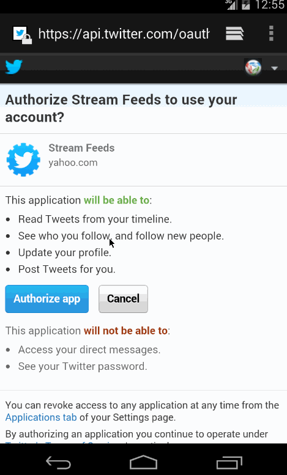

Simpe Twitter
==================
How many hours did it take to complete?
10 hours

Which required and optional stories have you completed?

* [x]User can sign in to Twitter using OAuth login
* [x]User can view the tweets from their home timeline
* [x]User should be able to see the username, name, body and timestamp for each tweet
* [x]User should be displayed the relative timestamp for a tweet "8m", "7h"
* [x]User can view more tweets as they scroll with infinite pagination
* [x]User can compose a new tweet
* [x]User can click a “Compose” icon in the Action Bar on the top right
* [x]User can then enter a new tweet and post this to twitter
* [x]User is taken back to home timeline with new tweet visible in timeline
* 

